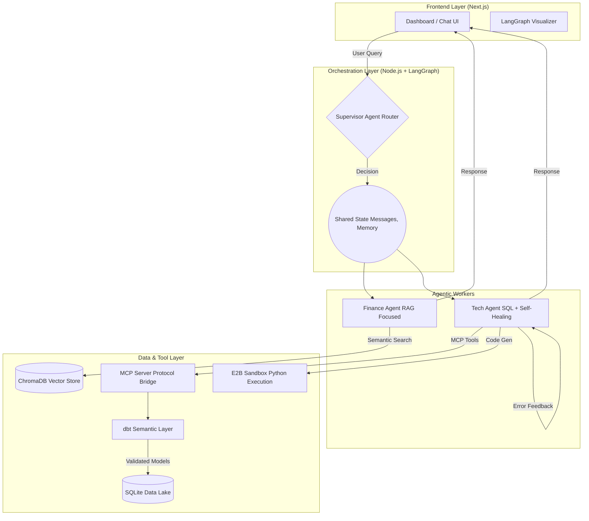
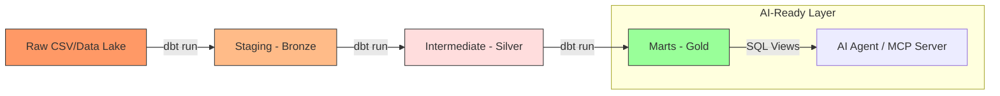

# Enterprise AI Orchestrator — Ажиллуулах гарын авлага (Developer Manual)

Энэхүү төсөл нь **Intelligent Supervisor Router (Ухаалаг чиглүүлэгч)**, **ChromaDB RAG (Бичиг баримт хайлт)**, болон **E2B Sandbox (Хамгаалалттай орчинд Python код ажиллуулах)** зэрэг дэд системүүдийг нэгтгэсэн олон агентын систем (Multi-Agent System) болон түүнийг хянах Next.js Dashboard UI хуудаснаас бүрдэнэ.

---

## Architecture (Системийн бүтэц)

Системийн архитектур нь **Multi-Agent Orchestration** болон **Multi-hop Data Engineering (dbt)** гэсэн хоёр үндсэн хэсгээс бүрдэнэ.

### 1. Системийн ерөнхий урсгал



### 2. Өгөгдлийн архитектур (dbt Multi-hop)

Системийн өгөгдлийг программ хангамжийн инженерчлэлийн түвшинд боловсруулахын тулд **dbt (data build tool)** ашиглан дараах "Multi-hop" бүтцийг хэрэгжүүлсэн:



*   **Staging (Bronze):** Түүхий өгөгдлийг цэвэрлэх, төрлийг стандартлах.
*   **Intermediate (Silver):** Бизнесийн нарийн логик, инкрементал (Incremental) тооцооллууд.
*   **Marts (Gold):** AI Агентад зориулсан баталгаажсан, тестлэгдсэн KPI-ууд (Sales, User Metrics).

### Инженерийн тайлбар

1.  **Orchestration Layer:** LangGraph дээр суурилсан Supervisor загвар нь хэрэглэгчийн асуултыг контекстээс хамааран Finance эсвэл Tech агентууд руу ухаалгаар чиглүүлдэг.
2.  **dbt (Data Build Tool):** AI агент түүхий өгөгдөл дээр шууд ажиллахаас сэргийлж, dbt-ээр дамжуулан "Semantic Layer" үүсгэсэн. Энэ нь AI-ийн "hallucination" буюу буруу тоо гаргах эрсдэлийг эрс бууруулдаг.
3.  **Self-Healing TechAgent:** TechAgent нь SQL код бичиж ажиллуулахдаа алдаа гарвал dbt-ийн моделийн тайлбаруудыг (metadata) ашиглан өөрөө засах чадвартай.
4.  **Data Quality:** dbt-ийн автомат тестүүд (not_null, unique, accepted_values) нь AI-д очиж буй өгөгдөл үргэлж үнэн зөв байх баталгаа болдог.

---

## Шаардлагатай зүйлс (Prerequisites)
...
Үүнийг ажиллуулахад дараах зүйлс таны компьютер дээр суусан байх шаардлагатай:
1. **Node.js** (v18 эсвэл түүнээс дээш)
2. **npm** (Node Package Manager)
3. **Docker Desktop** (заавал биш — ChromaDB болон Supabase-ийг локалоор ажиллуулахад хэрэглэнэ)

---

## 1. Орчны хувьсагчид тохируулах (.env)

Төслийн root хавтас доторх `.env` файлыг нээж, дараах түлхүүрүүдийг оруулах шаардлагатай. Жишээ тохиргоог `.env.example` файлаас харж болно.

```env
# LLM API Түлхүүр (Gemini 2.5 Flash ашиглах тул Google API Key байхад хангалттай)
GOOGLE_API_KEY=your_google_api_key_here

# Code Execution Sandbox (Код ажиллуулах хамгаалалттай орчин)
E2B_API_KEY=your_e2b_api_key_here  # Байхгүй тохиолдолд систем Mock горимоор ажиллана

# Chroma Vector DB тохиргоо (RAG хайлтад хэрэглэнэ)
CHROMA_URL=http://localhost:8000   # Docker-оор ажиллуулж байгаа үед

# JWT Authentication нууц үг (Вэб хэрэглэгчид нэвтрэх токен үүсгэхэд хэрэглэнэ)
JWT_SECRET=your_super_secret_jwt_key_here

# Агентын ажиллагааг хянах (Langfuse Observability - Сонголтоор)
LANGFUSE_SECRET_KEY=your_langfuse_secret_key
LANGFUSE_PUBLIC_KEY=your_langfuse_public_key
LANGFUSE_HOST=https://cloud.langfuse.com
```

---

## 2. Сангуудыг суулгах (Installation)

Төслийн root хавтас болон `ui` хавтас доторх сангуудыг дараах тушаалаар суулгана:

```bash
# 1. Төслийн root хавтасны сангуудыг суулгах
npm install --legacy-peer-deps

# 2. UI хавтасны сангуудыг суулгах
cd ui
npm install --legacy-peer-deps
cd ..
```

---

## 3. Тест ажиллуулах (Testing Suite)

Бүх систем хэвийн ажиллаж байгаа эсэхийг дараах тестүүдээр шалгана. (Эдгээр тестүүд нь автоматаар ажиллана):

```bash
# 1. Зөвхөн Gemini холболт болон Агентын чиглүүлэлтийг шалгах (Зөвлөмж болгож буй)
npm run test:gemini

# 2. Бусад системүүдтэй холбогдсон 4 үе шат бүхий цогц тестүүд ажиллуулах
npm run test:all
```

---

## 4. Төслийг ажиллуулах (Running the Application)

API Server болон Next.js вэб хуудсыг зэрэг ажиллуулахад маш хялбар. Төслийн root хавтсанд дараах тушаалыг ажиллуулна:

```bash
npm run dev
```

Энэхүү тушаал нь **`concurrently`** санг ашиглан 2 серверийг зэрэг эхлүүлнэ:
* **Backend API server**: `http://localhost:3001` дээр ажиллана.
* **Next.js Web UI**: `http://localhost:3000` дээр ажиллана.

---

## 5. Вэб хуудсыг ашиглах заавар (UI Walkthrough)

Сервер ажиллаж эхэлсний дараа вэб хөтөч дээрээ **[http://localhost:3000](http://localhost:3000)** хаягийг нээнэ.

### 5.1 Нэвтрэх (Login)
Систем одоо **нэгдсэн Admin эрхтэй** болсон тул та ямар ч и-мэйл, нууц үг ашиглан нэвтрэх боломжтой. Нэвтэрсний дараа системийн бүх боломжууд (SQL шинжилгээ, Python код ажиллуулах, KPI удирдах) танд нээлттэй болно.

### 5.2 Dashboard (Хянах самбар)
- **KPI үзүүлэлтүүд**: Таны оруулсан `retail_sales_dataset.csv` файл дээр суурилсан бодит өгөгдлийг (Sales Revenue, Active Users, Churn Rate) харуулна.
- **Target Manager**: Үзүүлэлтүүдийн зорилтот түвшнийг өөрөө гараараа шинэчилж, өгөгдлийн санд хадгалах боломжтой.

### 5.3 Дата болон Баримт бичиг ачаалах
- **CSV Upload**: Өөрийн датаг хуулж, AI-аар шинэ хүснэгт дээр шинжилгээ хийлгэх.
- **Document Indexing**: PDF болон Word файл уншуулж, AI-ийн мэдлэгийн санг (RAG) баяжуулах. Ингэснээр AI тухайн баримтын хүрээнд асуултад хариулах чадвартай болно.

### 5.3 Agent Routing Graph (Урсгал чиглүүлэгч харах)
- Таны асуусан асуултыг Router (Чиглүүлэгч) хэрхэн задлан шинжилж, цааш нь аль Агент руу (Finance эсвэл Tech) дамжуулж байгааг вэб дээр шууд хөдөлгөөнт дүрсээр харуулна.

### 5.4 Чатлах ба Урсгал (Streaming Mode)
- Зүүн доод хэсэгт байрлах **Enable Streaming (SSE)** сонголт идэвхтэй байхад хариултууд вэб рүү урсаж (chunk-by-chunk) орж ирнэ.
- Түргэн асуулт асуухын тулд чатны дээд талд байрлах **Suggested Prompts** картуудыг ашиглаж болно.
